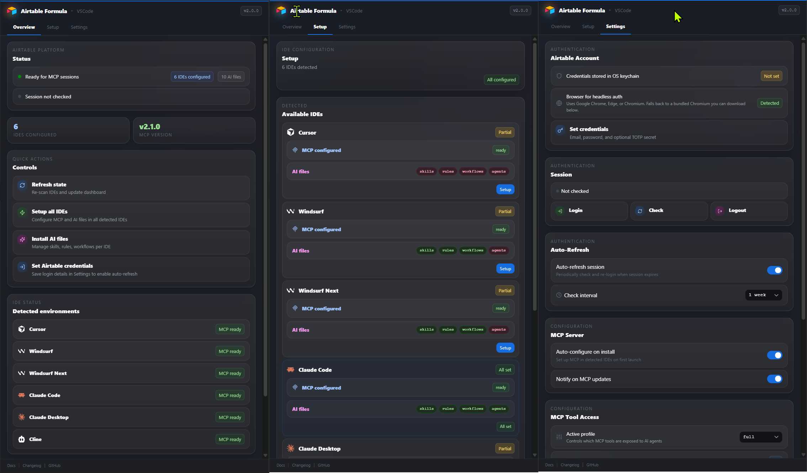

<div align="center">


# Airtable Formula

**Formula editor, MCP server, and AI skills for VS Code**

[](https://marketplace.visualstudio.com/items?itemName=Nskha.airtable-formula)
[](https://www.npmjs.com/package/airtable-user-mcp)
[](LICENSE)

<br />

> **Not affiliated with Airtable Inc.** This is a community-maintained project.

</div>

---

## What's In This Repo

This monorepo ships **two products** from one source tree:

<div align="center">

| | Product | Install |
|:-:|:--------|:--------|
|  | **Airtable Formula** — VS Code extension | [Marketplace](https://marketplace.visualstudio.com/items?itemName=Nskha.airtable-formula) |
|  | **airtable-user-mcp** — Standalone MCP server | `npx airtable-user-mcp` |

</div>

---

## Features

### VS Code Extension

- **Formula Editor** — Syntax highlighting, IntelliSense, beautify / minify for `.formula` files
- **MCP Server** — One-click MCP registration for multiple IDEs
- **AI Skills** — Auto-install Airtable-specific skills, rules, and workflows for AI coding assistants
- **Airtable Login** — Credentials in OS keychain, browser-based auth with auto-refresh
- **Dashboard** — React webview with Overview, Setup, and Settings tabs


# Screenshot



### MCP Server (30 Tools)

Manage Airtable bases with capabilities **not available through the official REST API**:

| Category | Tools | Highlights |
|:---------|:-----:|:-----------|
| **Schema Read** | 5 | Full schema inspection — bases, tables, fields, views |
| **Field Management** | 8 | Create formula / rollup / lookup / count fields, validate formulas |
| **View Configuration** | 11 | Filters, sorts, grouping, column visibility, row height |
| **Field Metadata** | 1 | Set or update field descriptions |
| **Extension Management** | 5 | Create, install, enable/disable, rename, remove extensions |

See the full tool reference in [`packages/mcp-server/README.md`](packages/mcp-server/README.md).

---

## Supported IDEs

The extension auto-configures MCP for all major AI-enabled editors:

<div align="center">

|  |  |  |  |  |  |
|:---:|:---:|:---:|:---:|:---:|:---:|
| Claude Desktop | Claude Code | Cursor | Windsurf | Cline | Amp |

</div>

**Don't use VS Code?** Use the standalone MCP server directly:

```bash
npx airtable-user-mcp
```

---

## Find Us

<div align="center">

| Registry | Link |
|:---------|:-----|
| **VS Code Marketplace** | [`Nskha.airtable-formula`](https://marketplace.visualstudio.com/items?itemName=Nskha.airtable-formula) |
| **npm** | [`airtable-user-mcp`](https://www.npmjs.com/package/airtable-user-mcp) |
| **Open VSX** | [`Nskha.airtable-formula`](https://open-vsx.org/extension/Nskha/airtable-formula) |
| **MCP Registry** | [`io.github.automations-project/airtable-user-mcp`](https://registry.modelcontextprotocol.io) |
| **Smithery** | [smithery.ai](https://smithery.ai) |
| **Glama** | [glama.ai/mcp/servers](https://glama.ai/mcp/servers) |
| **PulseMCP** | [pulsemcp.com](https://www.pulsemcp.com) |
| **MCP.so** | [mcp.so](https://mcp.so) |

</div>

---

## Requirements

- **VS Code** ^1.100.0 (or any fork exposing the `McpServerDefinitionProvider` API)
- **Node.js** — bundled via the VS Code runtime; no separate install needed
- **Google Chrome** (or Edge / Chromium) — the Airtable login flow uses [Patchright](https://github.com/Kaliiiiiiiiii/patchright-nodejs) in headless mode. Falls back to `msedge` on Windows and `chromium` on Linux. The extension shows an actionable warning if no supported browser is detected.

---

## Development

This is a **pnpm monorepo**.

| Package | Description |
|:--------|:------------|
| `packages/extension` | VS Code extension host (TypeScript + tsup) |
| `packages/webview` | React dashboard webview (Vite + Tailwind v4) |
| `packages/shared` | Shared types and message protocol |
| `packages/mcp-server` | [`airtable-user-mcp`](https://www.npmjs.com/package/airtable-user-mcp) — ESM Node MCP server |
| `scripts/` | Build tooling (esbuild bundler, dep vendoring) |

```bash
pnpm install          # install all packages
pnpm build            # build shared → webview → mcp bundle → extension
pnpm package          # build + create airtable-formula-X.Y.Z.vsix
pnpm test             # run all unit tests
pnpm dev              # start webview dev server (browser preview)
```

**How the MCP server is bundled:** `scripts/bundle-mcp.mjs` esbuilds `packages/mcp-server/src/` into `packages/extension/dist/mcp/`. Then `scripts/prepare-package-deps.mjs` vendors `patchright`, `patchright-core`, and `otpauth` into `dist/node_modules/` before `vsce package` runs. The VSIX is fully self-contained.

---

## License

[MIT](LICENSE)
