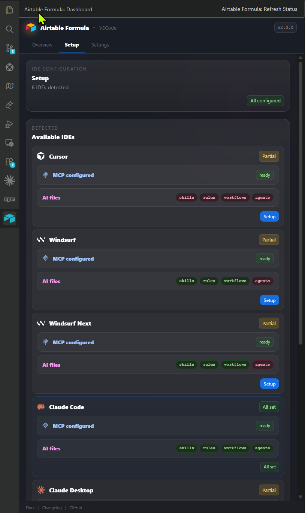

<div align="center">


# airtable-user-mcp

**Community MCP server for Airtable — 30 tools your AI assistant can't get from the official API**

[](https://www.npmjs.com/package/airtable-user-mcp)
[](https://modelcontextprotocol.io)
[](https://github.com/Automations-Project/VSCode-Airtable-Formula/blob/main/LICENSE)
[](https://marketplace.visualstudio.com/items?itemName=Nskha.airtable-formula)

<br />

> **Not affiliated with Airtable Inc.** This is a community-maintained project.

</div>

---

## Why this server?

The official Airtable REST API doesn't expose formula field creation, view configuration, or extension management. **airtable-user-mcp** fills that gap by using Airtable's internal API, giving your AI assistant capabilities that are otherwise only available through the Airtable UI.

<div align="center">

| | Capability | Official API | This Server |
|:-:|:-----------|:---:|:---:|
| **S** | Schema inspection (bases, tables, fields, views) | Partial | Full |
| **F** | Create formula / rollup / lookup / count fields | No | Yes |
| **V** | Validate formulas before applying | No | Yes |
| **C** | View config (filters, sorts, groups, visibility) | No | Yes |
| **E** | Extension / block management | No | Yes |

</div>

---

## Quick Start

```bash
npx airtable-user-mcp
```

That's it. Your MCP client connects via **stdio** and gets access to all 30 tools.

---

## Supported Clients

Works with any MCP-compatible client. Tested with:

<div align="center">

|  |  |  |  |  |  |
|:---:|:---:|:---:|:---:|:---:|:---:|
| Claude Desktop | Claude Code | Cursor | Windsurf | Cline | Amp |

</div>

### Advanced GUI

For a visual management experience, install the **[Airtable Formula](https://marketplace.visualstudio.com/items?itemName=Nskha.airtable-formula)** VS Code extension. It bundles this MCP server and adds:

- **One-click MCP registration** for Cursor, Windsurf, Claude Code, Cline, and Amp
- **Dashboard** with session status, version info, and setup wizard
- **Airtable login** with credentials in OS keychain and auto-refresh
- **Formula editor** with syntax highlighting, IntelliSense, and beautify/minify

<!-- TODO: Replace with actual screenshot -->
<!-- <p align="center"></p> -->

---

## Installation

### Via npx (recommended)

Add to your MCP client config (`mcp.json`, `claude_desktop_config.json`, etc.):

```json
{
  "mcpServers": {
    "airtable": {
      "command": "npx",
      "args": ["-y", "airtable-user-mcp"]
    }
  }
}
```

### Via VS Code / Windsurf / Cursor

Install the [Airtable Formula](https://marketplace.visualstudio.com/items?itemName=Nskha.airtable-formula) extension — it bundles this server and registers it automatically across all your IDEs.

### From Extension (GUI)


### From source
```json
{
  "mcpServers": {
    "airtable": {
      "command": "node",
      "args": ["/path/to/airtable-user-mcp/src/index.js"]
    }
  }
}
```

---

## Authentication

The server uses browser-based authentication via [Patchright](https://github.com/Kaliiiiiiiiii/patchright-nodejs).

```bash
# 1. Install the browser engine (one-time, ~170 MB)
npx airtable-user-mcp install-browser

# 2. Log in to Airtable
npx airtable-user-mcp login

# 3. Verify your session
npx airtable-user-mcp status
```

Sessions are cached in `~/.airtable-user-mcp/` and reused automatically.

**Headless / CI environments:** Set `AIRTABLE_NO_BROWSER=1` to use cached cookies only, without launching a browser.

**Diagnostics:** Run `npx airtable-user-mcp doctor` to check browser availability, session health, and config.

---

## Tools (30)

### Schema Read (5)

| Tool | Description |
|:-----|:------------|
| `get_base_schema` | Full schema of all tables, fields, and views in a base |
| `list_tables` | List all tables in a base with IDs and names |
| `get_table_schema` | Full schema for a single table |
| `list_fields` | All fields in a table with types and configuration |
| `list_views` | All views in a table with IDs, names, and types |

### Field Management (8)

| Tool | Description |
|:-----|:------------|
| `create_field` | Create a field — including formula, rollup, lookup, count |
| `create_formula_field` | Create a formula field (shorthand) |
| `validate_formula` | Validate a formula expression before applying |
| `update_formula_field` | Update the formula text of an existing field |
| `update_field_config` | Update configuration of any computed field |
| `rename_field` | Rename a field with pre-validation |
| `delete_field` | Delete with safety guards and dependency checks |
| `duplicate_field` | Clone a field, optionally copying cell values |

### View Configuration (11)

| Tool | Description |
|:-----|:------------|
| `create_view` | Create grid, form, kanban, calendar, gallery, gantt, or list view |
| `duplicate_view` | Clone a view with all configuration |
| `rename_view` | Rename a view |
| `delete_view` | Delete a view (cannot delete last view) |
| `update_view_description` | Set or clear a view's description |
| `update_view_filters` | Set filter conditions with AND/OR conjunctions |
| `reorder_view_fields` | Change column order |
| `show_or_hide_view_columns` | Toggle column visibility |
| `apply_view_sorts` | Set or clear sort conditions |
| `update_view_group_levels` | Set or clear grouping |
| `update_view_row_height` | Change row height (small / medium / large / xlarge) |

### Field Metadata (1)

| Tool | Description |
|:-----|:------------|
| `update_field_description` | Set or update a field's description text |

### Extension Management (5)

| Tool | Description |
|:-----|:------------|
| `create_extension` | Register a new extension/block in a base |
| `create_extension_dashboard` | Create a new dashboard page |
| `install_extension` | Install an extension onto a dashboard page |
| `update_extension_state` | Enable or disable an installed extension |
| `rename_extension` | Rename an installed extension |
| `duplicate_extension` | Clone an installed extension |
| `remove_extension` | Remove an extension from a dashboard |

---

## Usage Examples

### Inspect a base schema

```
Tool: list_tables
Args: { "appId": "appXXXXXXXXXXXXXX" }
```

### Create and validate a formula

```
Tool: validate_formula
Args: { "appId": "appXXX", "tableId": "tblXXX", "formulaText": "IF({Price}>0,{Price}*{Qty},0)" }

Tool: create_formula_field
Args: { "appId": "appXXX", "tableId": "tblXXX", "name": "Total", "formulaText": "IF({Price}>0,{Price}*{Qty},0)" }
```

### Configure view filters

```
Tool: update_view_filters
Args: {
  "appId": "appXXX",
  "viewId": "viwXXX",
  "filters": {
    "filterSet": [
      { "columnId": "fldXXX", "operator": "isNotEmpty" }
    ],
    "conjunction": "and"
  }
}
```

---

## Safety

- **Destructive operations** (`delete_field`, `delete_view`, `remove_extension`) include built-in safety guards
- `delete_field` requires both `fieldId` **and** `expectedName`, and checks for downstream dependencies before deleting
- Formula validation is available and recommended before creating/updating formulas
- All tools accept `debug: true` for raw response inspection

---

## ID Format Reference

| Entity | Prefix | Example |
|:-------|:-------|:--------|
| Base / App | `app` | `appXXXXXXXXXXXXXX` |
| Table | `tbl` | `tblXXXXXXXXXXXXXX` |
| Field | `fld` | `fldXXXXXXXXXXXXXX` |
| View | `viw` | `viwXXXXXXXXXXXXXX` |
| Block | `blk` | `blkXXXXXXXXXXXXXX` |
| Block Installation | `bli` | `bliXXXXXXXXXXXXXX` |
| Dashboard Page | `bip` | `bipXXXXXXXXXXXXXX` |

---

## Protocol

| | |
|:--|:--|
| **Transport** | stdio (JSON-RPC 2.0) |
| **MCP Version** | 2025-11-25 |
| **SDK** | `@modelcontextprotocol/sdk` v1.27.1 |

---

## Find Us

| Registry | Link |
|:---------|:-----|
| **npm** | [`airtable-user-mcp`](https://www.npmjs.com/package/airtable-user-mcp) |
| **VS Code Marketplace** | [`Nskha.airtable-formula`](https://marketplace.visualstudio.com/items?itemName=Nskha.airtable-formula) |
| **GitHub** | [`Automations-Project/VSCode-Airtable-Formula`](https://github.com/Automations-Project/VSCode-Airtable-Formula) |
| **MCP Registry** | [`io.github.automations-project/airtable-user-mcp`](https://registry.modelcontextprotocol.io) |
| **Smithery** | [smithery.ai](https://smithery.ai) |
| **Glama** | [glama.ai/mcp/servers](https://glama.ai/mcp/servers) |
| **PulseMCP** | [pulsemcp.com](https://www.pulsemcp.com) |

---

## Related

- [**Airtable Formula** VS Code Extension](https://github.com/Automations-Project/VSCode-Airtable-Formula) — Dashboard, formula editor, MCP installer, and AI skills
- [Model Context Protocol](https://modelcontextprotocol.io) — The open standard for AI tool integration

## License

[MIT](https://github.com/Automations-Project/VSCode-Airtable-Formula/blob/main/LICENSE)
